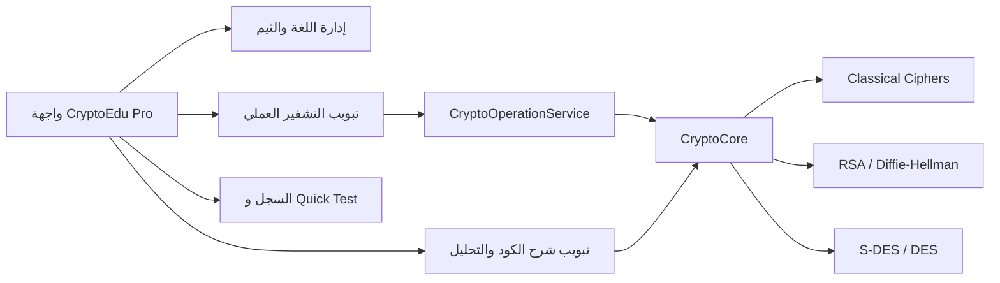

# CryptoEdu Pro

<div align="center">

## منصة تعليمية تفاعلية لفهم التشفير خطوة بخطوة

[](https://www.python.org/)
[](https://customtkinter.tomschimansky.com/)
[](#تنبيه-تعليمي)
[](#خطة-التطوير)

**CryptoEdu Pro** هو تطبيق مكتبي تعليمي يساعد الطلاب والمطورين على تجربة خوارزميات التشفير، ومشاهدة النتائج، وفهم الكود والعمليات الرياضية خلف كل خوارزمية من خلال واجهة رسومية حديثة تدعم العربية والإنجليزية.

[نظرة عامة](#نظرة-عامة) · [المزايا](#المزايا) · [التثبيت والتشغيل](#التثبيت-والتشغيل) · [الخوارزميات](#الخوارزميات) · [البنية](#بنية-المشروع) · [خطة التطوير](#خطة-التطوير)

</div>

---

## نظرة عامة

تم تصميم المشروع ليكون مساحة تعليمية عملية بدلًا من الاكتفاء بالشرح النظري. يختار المستخدم خوارزمية، يدخل النص والمفتاح المناسب، ثم يستطيع:

- تشفير النص أو فك تشفيره.
- نسخ النتيجة أو نقلها إلى خانة الإدخال.
- مشاهدة تحليل بصري وتدريجي للعملية.
- الاطلاع على الكود الكامل للخوارزمية.
- قراءة شرح مبسط لكل جزء من الكود.
- تغيير اللغة والثيم أثناء الاستخدام.
- تجربة أمثلة جاهزة من خلال **Quick Test**.

> **تنبيه مهم:** هذا المشروع تعليمي. الخوارزميات الموجودة هنا مطبقة من الصفر بهدف الفهم والتجربة، ولا ينبغي استخدامها لحماية بيانات حقيقية أو في أنظمة إنتاجية.

<a id="تنبيه-تعليمي"></a>

> **تنبيه تعليمي:** لا تستخدم هذا المشروع لتشفير كلمات المرور أو الملفات أو البيانات الحساسة. للاستخدام العملي، اعتمد على مكتبات تشفير موثوقة ومراجعة أمنيًا.

---

## المزايا

### تجربة تعليمية تفاعلية

- واجهة رسومية مبنية باستخدام **CustomTkinter**.
- تبويب للتشفير العملي وتبويب لشرح الكود.
- تحليل خطوة بخطوة لبعض الخوارزميات.
- عرض الصيغ الرياضية والمصفوفات والمراحل الوسيطة عند توفرها.
- أمثلة تشغيل جاهزة لكل خوارزمية.

### دعم اللغتين

- العربية كلغة افتراضية.
- الإنجليزية.
- معالجة أولية لمشكلة اتجاه النص المختلط RTL/LTR.
- واجهة قابلة للتبديل أثناء تشغيل التطبيق.

### تخصيص الواجهة

- ثيم Midnight.
- ثيم Ocean.
- ثيم Purple Haze.
- ثيم Emerald.
- سجل مختصر للعمليات الأخيرة.
- عداد الحروف والكلمات.
- ألوان منفصلة للتشفير وفك التشفير والحالات المختلفة.

---

## الخوارزميات

| الخوارزمية | النوع | الهدف التعليمي | شكل الإدخال الأساسي |
|---|---|---|---|
| Caesar | استبدال بسيط | فهم الإزاحة الأبجدية | نص + رقم الإزاحة |
| Affine | استبدال رياضي | فهم الدالة `(m × x + k) mod 26` | نص + `m` + `k` |
| Vigenère | استبدال متعدد الأبجديات | فهم المفتاح الدوري | نص + كلمة مفتاحية |
| Playfair | استبدال أزواج | فهم مصفوفة 5×5 | نص + كلمة مفتاحية |
| Hill | تشفير بالمصفوفات | فهم ضرب المصفوفات modulo 26 | نص + مصفوفة 2×2 |
| Diffie-Hellman | تبادل مفاتيح | فهم إنشاء مفتاح مشترك | `p` و`g` و`a` و`b` |
| RSA | تشفير غير متماثل | فهم المفاتيح العامة والخاصة | `p` و`q` و`e` |
| S-DES | تشفير كتلي مبسط | فهم الجولات والمفاتيح الفرعية | كتلة 8-bit + مفتاح 10-bit |
| DES | تشفير كتلي | دراسة Feistel والجولات والمبدلات | كتلة 64-bit + مفتاح 64-bit |

### ملاحظات على نطاق الدعم

- التنفيذ الحالي موجه أساسًا للنصوص والأبجديات الإنجليزية في الخوارزميات الكلاسيكية.
- واجهة التطبيق تدعم العربية، لكن هذا لا يعني أن كل خوارزمية تدعم تشفير الأحرف العربية رياضيًا.
- بعض الخوارزميات، مثل S-DES وDES، تتطلب إدخالًا ثنائيًا بطول محدد.
- RSA وDES هنا لأغراض تعليمية، وليس كبديل لمكتبات التشفير الموثوقة.

---

## المتطلبات

- Python 3.10 أو أحدث.
- Tkinter.
- نظام Windows أو Linux أو macOS يدعم Tkinter.
- الاعتماديات الموجودة في `requirements.txt`.

### الاعتماديات الرئيسية

```text
customtkinter>=5.2.0
pyperclip
```

---

## التثبيت والتشغيل

### 1. استنساخ المشروع

```bash
git clone https://github.com/Dev-KAIDO/CryptoEdu-Pro.git
cd CryptoEdu-Pro
```

### 2. إنشاء بيئة افتراضية — موصى به

#### Windows

```powershell
python -m venv .venv
.venv\Scripts\activate
```

#### Linux / macOS

```bash
python3 -m venv .venv
source .venv/bin/activate
```

### 3. تثبيت الاعتماديات

```bash
python -m pip install --upgrade pip
python -m pip install -r requirements.txt
```

### 4. تشغيل التطبيق

```bash
python main.py
```

> في Linux قد تحتاج إلى تثبيت حزمة Tkinter من مدير الحزم، مثل `python3-tk`.

---

## الاستخدام السريع

1. شغّل التطبيق.
2. اختر الخوارزمية من القائمة الجانبية.
3. أدخل النص أو الكتلة الثنائية المطلوبة.
4. أدخل المفتاح أو القيم الرياضية المطلوبة.
5. اضغط **تشفير** أو **فك التشفير**.
6. استخدم **التحليل** لمشاهدة خطوات العملية.
7. انتقل إلى تبويب **شرح الكود** لمراجعة التنفيذ والمثال.
8. استخدم **Quick Test** لتعبئة مثال جاهز تلقائيًا.

---

## أمثلة سريعة

### Caesar

```text
Input:  HELLO WORLD
Key:    3
Output: KHOOR ZRUOG
```

### Vigenère

```text
Input:  ATTACKATDAWN
Key:    LEMON
Output: LXFOPVEFRNHR
```

### RSA التعليمي

```text
p = 61
q = 53
e = 17
```

ينشئ التطبيق القيم الرياضية اللازمة داخليًا ويعرض النص المشفر على شكل أرقام مفصولة بفواصل.

### S-DES

```text
Plaintext: 10101101
Key:       1010110011
Result:    00111100
```

### DES

يعمل التطبيق على كتلة ثنائية بطول 64 بت ومفتاح ثنائي بطول 64 بت، ويعرض خطوات التبديل والجولات في صفحة التحليل.

---

## بنية المشروع

```text
CryptoEdu-Pro/
├── main.py                 # نقطة التشغيل وواجهة التطبيق الرئيسية
├── core/
│   ├── algorithms.py       # تنفيذ الخوارزميات ومواد الشرح
│   ├── education.py        # أمثلة الكود والشرح التعليمي للواجهة
│   ├── service.py          # طبقة تنفيذ مستقلة عن واجهة المستخدم
│   └── textutils.py        # أدوات معالجة اتجاه النص المختلط
├── ui/
│   ├── styles.py           # الألوان والخطوط والأحجام
│   ├── translations.py     # النصوص العربية والإنجليزية
│   └── widgets.py          # مكونات واجهة قابلة لإعادة الاستخدام
├── tests/
│   └── test_algorithms.py  # اختبارات الرجوع والتحقق من المدخلات
│   └── test_service.py      # اختبارات طبقة تنفيذ العمليات
├── CryptoEdu.spec          # إعداد بناء PyInstaller
├── cryptoedu.ico           # أيقونة التطبيق
├── requirements.txt        # الاعتماديات
└── README.md               # توثيق المشروع
```

### مخطط المكونات



### ملاحظة عن ملفات الإصلاح القديمة

يحتوي المستودع حاليًا على بعض ملفات الإصلاح المؤقتة التي استُخدمت أثناء التطوير، مثل `fix_bugs.py` و`fix_output.py`. هذه الملفات مرتبطة بمسارات محلية وقد تحتاج إلى نقلها أو حذفها بعد تثبيت الإصلاحات في الكود الأساسي.

---

## بناء نسخة تنفيذية

يوجد ملف إعداد مبدئي لـ PyInstaller باسم:

```text
CryptoEdu.spec
```

بعد تثبيت PyInstaller يمكن تجربة البناء باستخدام:

```bash
python -m pip install pyinstaller
pyinstaller CryptoEdu.spec
```

ستظهر الملفات الناتجة عادة داخل مجلدي `build/` و`dist/`.

> يفضل اختبار النسخة التنفيذية على جهاز نظيف قبل توزيعها، والتأكد من وجود الأيقونة والموارد والمكونات المطلوبة.

---

## الجودة والحالة الحالية

المشروع يعمل كنسخة تعليمية قابلة للتجربة، وقد تم اختبار تشغيل الواجهة وتجربة الخوارزميات الأساسية. ومع ذلك، ما زالت هناك أعمال تحسين مهمة قبل اعتباره إصدارًا مستقرًا أو جاهزًا للاستخدام العام.

### أبرز الأعمال القادمة

- تحسين التحقق من المدخلات ورسائل الأخطاء.
- تحديد أو توسيع دعم الأبجدية العربية داخل الخوارزميات.
- إضافة اختبارات تلقائية مستقلة.
- تنظيف ملفات Python المؤقتة والملفات الناتجة من البناء.
- تقسيم `main.py` إلى وحدات أصغر وأكثر قابلية للصيانة.
- تحسين توثيق الأمثلة والنتائج.
- إضافة GitHub Actions للفحص والبناء.
- تحسين الوصولية وتجربة الاستخدام.

### الإصلاحات المنجزة في المرحلة الحالية

- [x] منع Vigenère من الانهيار عند المفتاح الفارغ أو غير الصالح.
- [x] منع Playfair وHill من الانهيار عند الرموز أو الأطوال غير المناسبة.
- [x] إضافة تحقق للقيم غير الصالحة في Diffie-Hellman.
- [x] تقوية تحقق RSA ومنع فقدان البيانات عندما تكون قيمة الحرف أكبر من `n`.
- [x] منع تحويل الأحرف غير الإنجليزية إلى نتائج خاطئة بصمت.
- [x] إضافة 17 اختبارًا تلقائيًا للرجوع والتحقق من المدخلات.
- [x] تصحيح مثال RSA داخل واجهة شرح الكود ليطابق الناتج الفعلي.
- [x] توحيد مساري التشفير وفك التشفير في معالج واحد داخل الواجهة.
- [x] توحيد نص عداد العمليات عبر ملفات الترجمة بدل النصوص الثابتة.
- [x] فصل اختيار الخوارزمية وقراءة المفاتيح في `core/service.py` بعيدًا عن Tkinter.
- [x] إضافة اختبارات مباشرة لطبقة الخدمة، ليصبح إجمالي الاختبارات 22 اختبارًا.
- [x] نقل كتالوج الأكواد والشروحات إلى `core/education.py` مع إبقاء واجهات التوافق القديمة.
- [x] فرض حدود للنصوص والأعداد في الوضع التعليمي لمنع استهلاك الموارد المفرط.
- [x] اختصار التحليل الرسومي إلى أول 100 حرف مع إبقاء النتيجة الكاملة دون تغيير.
- [x] جعل سجل العمليات وصفيًا فقط دون حفظ النصوص أو النتائج أو المفاتيح.

---

## خطة التطوير حسب الأولوية

هذه الخطة هي نقطة البداية لإعادة بناء المشروع ورفعه من نموذج متوسط إلى مشروع أكثر احترافية.

### المستوى الأول — حرج وعالي الأولوية

هذه العناصر تؤثر في صحة النتائج واستقرار التطبيق ويجب معالجتها أولًا:

- منع Vigenère من الانهيار عند ترك المفتاح فارغًا.
- التحقق من نوع ومحتوى مفاتيح Vigenère.
- تنظيف مدخلات Playfair والتحقق من الرموز غير المدعومة.
- منع Hill من استقبال مفاتيح ناقصة أو نصوص غير مناسبة.
- إضافة تحقق صحيح لقيم Diffie-Hellman السالبة والصفرية.
- إضافة تحقق أقوى لقيم RSA، مع توضيح حدود RSA التعليمي.
- معالجة الأحرف غير الإنجليزية بدل تحويلها إلى نتائج خاطئة بصمت.
- منع أخطاء الواجهة الناتجة عن الإدخال غير الصحيح وإظهار رسائل مفهومة.

### المستوى الثاني — متوسط الأولوية

هذه العناصر تحسن قابلية الصيانة وتجربة المستخدم:

- تقسيم `main.py` إلى وحدات مستقلة.
- نقل الخوارزميات إلى ملفات متخصصة.
- فصل منطق التحليل عن منطق التشفير.
- توحيد التحقق من المفاتيح في طبقة واحدة.
- إزالة `except Exception` الواسعة أو استبدالها بمعالجة محددة.
- توحيد النصوص المترجمة بدل وجود نصوص ثابتة داخل `main.py`.
- مراجعة أمثلة الشرح للتأكد من تطابقها مع النتائج الفعلية.
- تحسين واجهة RTL والعرض المختلط بين العربية والإنجليزية.
- تحسين إدارة سجل العمليات وحفظه عند الحاجة.

### المستوى الثالث — تنظيف وتحسينات منخفضة الأولوية

هذه العناصر لا تمنع الاستخدام الأساسي، لكنها ترفع جودة المشروع:

- إزالة ملفات `.pyc` المتتبعة في Git.
- إزالة المسار المتداخل أو الـ submodule غير المكتمل.
- حذف أو إعادة تنظيم ملفات `fix_*.py` المؤقتة.
- إضافة صور ولقطات شاشة للتوثيق.
- إضافة اختبارات أداء للخوارزميات والتحليل البصري.
- إضافة إعدادات تنسيق وفحص للكود.
- إضافة ترخيص واضح للمشروع.
- إضافة نظام إصدارات وملف `CHANGELOG.md`.
- إضافة قوالب Issues وPull Requests.

---

## الاختبارات المقترحة

سيتم بناء مجموعة اختبارات مستقلة تغطي:

- التشفير ثم فك التشفير لكل خوارزمية.
- أمثلة معيارية معروفة مثل DES وVigenère.
- المفاتيح الفارغة والناقصة وغير الصحيحة.
- النصوص العربية والإنجليزية والنصوص المختلطة.
- الرموز وعلامات الترقيم.
- الحدود الرياضية الخاصة بـ RSA وDiffie-Hellman وHill.
- تشغيل الواجهة وتغيير اللغة والثيم والخوارزمية.

الهدف هو أن يصبح تشغيل الاختبارات جزءًا ثابتًا من كل تعديل:

```bash
python -m unittest discover -s tests -v
```

---

## المساهمة

المشروع في مرحلة تطوير وتحسين مستمر. عند إضافة تعديل جديد يفضل اتباع الخطوات التالية:

1. إنشاء Branch مستقل.
2. وصف المشكلة أو الفكرة بوضوح.
3. إضافة اختبار للحالة الجديدة إن أمكن.
4. اختبار الواجهة والخوارزمية يدويًا.
5. التأكد من عدم إضافة ملفات بناء أو Cache إلى Git.
6. كتابة Commit واضح ومحدد.

---

## الترخيص

لم تتم إضافة ملف ترخيص للمشروع حتى الآن. يوصى باختيار ترخيص مناسب وإضافته في ملف `LICENSE` قبل توزيع المشروع أو السماح بإعادة استخدامه.

---

## المطور

**Mr. Kaido**

مشروع تعليمي مفتوح للتطوير بهدف تبسيط مفاهيم التشفير وتحويلها إلى تجربة عملية وتفاعلية.

---

<div align="center">

**CryptoEdu Pro — Learn the algorithm, understand the process.**

</div>
